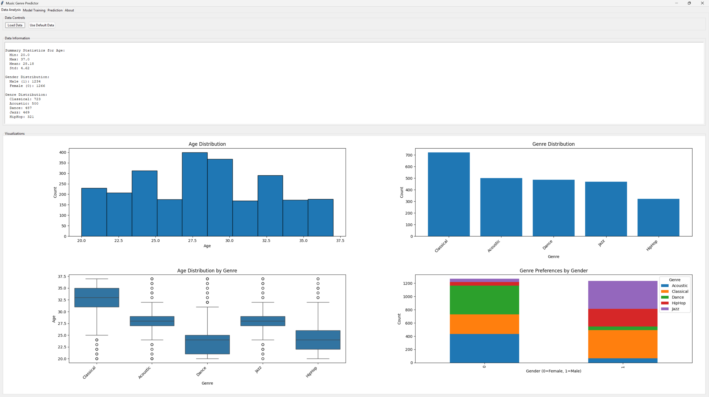

# Music Genre Predictor

A machine learning application that predicts music genre preferences based on age and gender, built with Python and Tkinter.

## Features

- **Data Analysis**: Load and explore your dataset with detailed statistics and visualizations
- **Data Cleaning**: Automatic detection and handling of missing values and outliers
- **Model Training**: Train machine learning models using multiple algorithms:
  - Gaussian Naive Bayes
  - K-Nearest Neighbors
  - Random Forest
- **Interactive Prediction**: Make predictions on new data points and visualize results
- **Model Management**: Save and load trained models for future use
- **User-Friendly Interface**: Tab-based GUI with intuitive controls

## Screenshots


2. training_model.png
3. prediction.png

## Installation

### Prerequisites

- Python 3.7+
- Required libraries

### Setup

1. Clone this repository or download the source files

2. Install required dependencies:

```bash
pip install pandas numpy matplotlib seaborn scikit-learn
```

3. Run the application:

```bash
python music2.py
```

## Usage Guide

### 1. Data Analysis Tab

- **Load Data**: Import your own CSV file or use the built-in default dataset
- **Data Information**: View statistics about your dataset including age and gender distribution
- **Visualizations**: Explore age distribution, genre distribution, and relationships between variables

### 2. Model Training Tab

- **Model Selection**: Choose between Gaussian Naive Bayes, K-Nearest Neighbors, and Random Forest
- **Test Size**: Adjust the train-test split ratio
- **Training Results**: View accuracy, classification report, and confusion matrix
- **Save/Load Model**: Preserve your trained model for future use

### 3. Prediction Tab

- **Input Parameters**: Enter age and select gender
- **Make Predictions**: Get instant genre predictions
- **Common Patterns**: View insights about genre preferences based on age and gender

### 4. About Tab

- View information about the application and its features

## Data Format

The application expects CSV files with at least these columns:
- `age`: Numeric age values
- `gender`: Binary (0 = Female, 1 = Male)
- `genre`: String values representing music genres

Example CSV format:
```
age,gender,genre
25,1,HipHop
30,0,Classical
22,1,Rock
...
```

## How It Works

1. **Data Processing**: The application loads and preprocesses your data, identifying and handling missing values and outliers
2. **Feature Scaling**: Age and gender values are standardized
3. **Model Training**: Machine learning algorithms are trained on your data
4. **Evaluation**: Models are evaluated using metrics like accuracy and confusion matrix
5. **Prediction**: New data points can be classified into music genres

## License

(c)Fredrik Barré 2025

## Acknowledgments

- Built with scikit-learn, pandas, and Tkinter
- Created for educational and demonstration purposes
